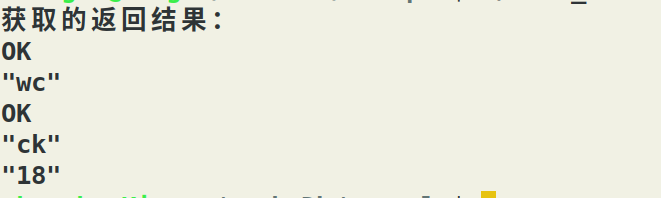
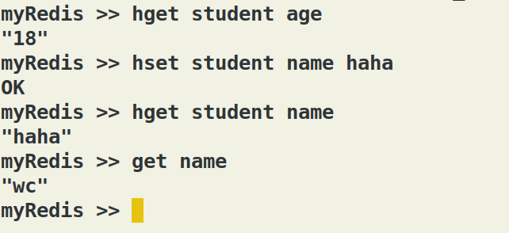
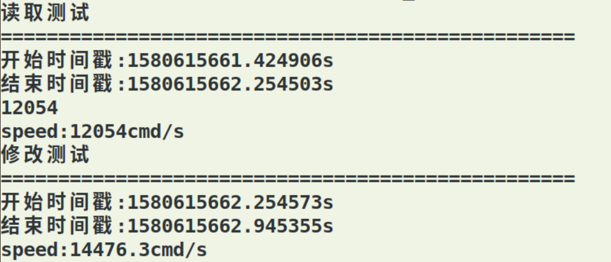

### MyCacheDB介绍
MyCacheDB是一个基于C/S架构的小型缓存数据库，支持string，hash，list，set，sortset对象的基本操作，提供易用的用户编程和终端输入接口

### 运行环境

- 系统：ubuntu19.10
- 处理器：Intel® Core™ i5-7300HQ CPU @ 2.50GHz × 4
- 内存：7.7 GiB
- 依赖：[Google Protocol Buffers](https://github.com/protocolbuffers/protobuf)，机器需支持proto命令
- 编译器：Gcc编译器，Vim+Vimplus开发环境

### 特性

- 双端协议都是使用[Google Protocol Buffers](https://developers.google.cn/protocol-buffers/),程序中都设计了序列化和反序列化模块
- 使用智能指针管理对像，避免内存泄漏

**服务端**
- 分模块实现，主要包含IO处理模块、命令及其回调函数模块、数据库对象模块、日志记录模块和持久化及数据库恢复模块
- IO处理模块中，采用Epoll IO多路复用机制，每个被监听事件的类型都为Epoll LT+EPOLLIN+非阻塞，有事件到时，通过回调函数处理
- 使用最小堆定时器检测并移除闲置客户端
- 设计模式，项目中使用到了工厂模式降低代码的重复，单例模式创建特定对象，提供唯一实例的受控访问，节约系统资源
- 使用Easyloging++进行日志文件滚动记录日志
- 有序集合对象通过[自己实现红黑树数据结构](https://blog.csdn.net/qq_41681241/article/details/103552988)进行管理，查找时间效率高
- 持久化模块，同步持久化和异步持久化。使用快照机制，保证数据不丢失。fork子进程进行异步持久化
- 设计分库管理机制，1号数据库存储在.db_1文件中......依次类推，所有数据库名称保存在另一个文件中，开机时通过mmap对.db_\*文件进行读取
- 当缓存不够用的时候，会随机选一些键进行淘汰

**客户端**
- 客户端实现异步发收命令功能

### 目录说明

|名称|作用|
|:---:|:--:|
|client|客户端源代码实现|
|server|服务器源代码|
|conf|配置文件|
|image|一些截图信息|
|logInfo|日志记录文件|
|start.sh|编译程序的shell命令脚本|
|test|客户端测试文件|
|example|例子程序|

### 使用与安装

（1）修改配置文件，进入conf文件，打开配置文件填写IP和端口信息，格式为冒号+空格+IP/端口

（2）修改start.sh文件的权限

```

chmod a+x start.sh   //当前目录中必须有start.sh文件

```
（3）进入server目录，运行服务器

```
./Server
```

（4）进入client目录，执行

```
sudo cp -R MyCacheDB /usr/include
sudo mv DBClient /usr/sbin
```
进入client下的lib目录，将其中的静态库文件移动到你自定义程序的目录下，需要在编译时链接

（5）编写自定义的程序如下

`main.cpp`


```c
#include <iostream>
#include <MyCacheDB/clientLoop.h>
using namespace std ;
int main(int argc, char** argv) {
    clientLoop clp ;
    //传入IP 和地址
    clp.init("127.0.0.1", "8888") ;
   //在配置文件中找
    //clp.init() ;
//////////////////////////////程序中使用
    clp.sendRequest("set", "name", "wc", END) ;
    clp.sendRequest("get", "name", END) ;
    clp.sendRequest("hset", "student", "name","ck", "age", "18", END) ;
    clp.sendRequest("hget", "student", "name", END) ;
    clp.sendRequest("hget", "student", "age", END) ;
    //........   

    //////////////////////////获取结果
    cout << "获取的返回结果：" << endl ;
    clp.getResult() ;
    clp.getResult() ;
    clp.getResult() ;
    clp.getResult() ;
    clp.getResult() ;

///////////////////////////////////////////////终端使用
//    clp.start() ;
    return 0;
}
```

编译
```
g++ main.cpp libclient.a -lpthread -g -std=c++11 -w -lprotobuf -lreadline `pkg-config --cflags --libs protobuf` -o test_exe
```
运行：

```
./test_exe
```

运行截图：



运行client目录下DBClient，终端用户C/S交互截图：




### 测试

- 编写的测试程序：

`test.cpp`

```c

#include <iostream>
#include <sys/time.h>
#include <MyCacheDB/clientLoop.h>
using namespace std ;
int main(int argc, char** argv) {
    struct timeval tv, tend;
    clientLoop clp ;
    clp.init("127.0.0.1", "8888") ;
    gettimeofday(&tv,NULL);
    int a = 10000 ;
    while(a--) {
        clp.sendRequest("get", "name", END) ;
        clp.getResult() ;
    }

    gettimeofday(&tend,NULL);
    cout << "读取测试" << endl ;
    cout << "==================================================" << endl ;
    cout <<"开始时间戳:"<< tv.tv_sec<<"." << tv.tv_usec<<"s"<< endl;
    cout <<"结束时间戳:"<< tend.tv_sec<<"." << tend.tv_usec<<"s"<< endl;
    int s = (tend.tv_sec-tv.tv_sec)*1000000 ;
    int us = tend.tv_usec - tv.tv_usec ;
    double h = 10000;
    int end = s + us ;
    cout <<h*1000000/end<< endl ;
    cout << "speed:" << h*1000000/end <<"cmd/s"<< endl ;
    struct timeval tv1, tend1;
    gettimeofday(&tv1,NULL);
    a = 10000 ;
    while(a--) {
        clp.sendRequest("hset", "student", "name","ck", "age", "18", END) ;
        clp.getResult() ;
    }
    gettimeofday(&tend1,NULL);
    cout << "修改测试" << endl ;
    cout << "==================================================" << endl ;
    cout <<"开始时间戳:"<< tv1.tv_sec<<"." << tv1.tv_usec<<"s"<< endl;
    cout <<"结束时间戳:"<< tend1.tv_sec<<"." << tend1.tv_usec<<"s"<< endl;
    s = (tend1.tv_sec-tv1.tv_sec)*1000000 ;
    us = tend1.tv_usec - tv1.tv_usec ;
    h = 10000;
    end = s + us ;
    cout <<"speed:" << h*1000000/end<<"cmd/s"<< endl ;
    return 0;
}

```

- 编译

```
g++ test.cpp libclient.a -lpthread -g -std=c++11 -w -lprotobuf -lreadline `pkg-config --cflags --libs protobuf` -o test_exe
```

运行结果：

- 服务器刚启动，不会进行初始化。在接收到命令后，会进行一系列初始化，显示结果，第一次执行get命令和第二次执行结果相比较慢


- 第二次运行客户端发送命令，服务器不需要初始化了，相比第一次执行较快




